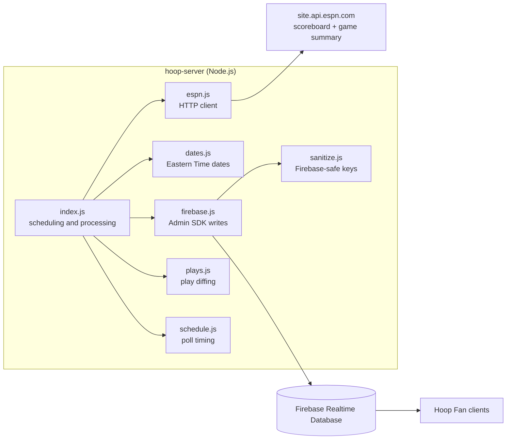
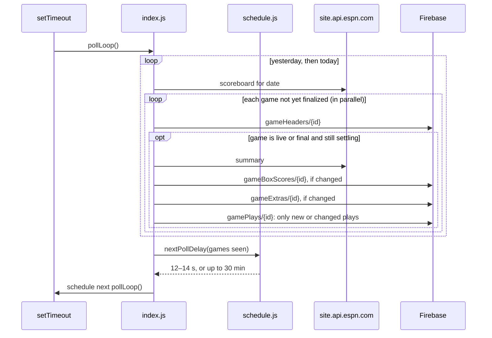

# Architecture

hoop-server is a background worker for the Hoop Fan app. It has no HTTP API of its own: it polls ESPN's NBA data and mirrors scoreboards, box scores, and play-by-play into the Firebase Realtime Database, where client apps read them.



## Modules

| File | Responsibility |
| --- | --- |
| `index.js` | Entry point. Runs the startup backfill and the polling loop, decides which games need data, and writes it to Firebase. |
| `espn.js` | Thin HTTP client over ESPN's site API. A shared axios instance applies a 10-second timeout. Functions return axios promises and throw on failure. |
| `dates.js` | `etDate(offsetDays)` returns `YYYY-MM-DD` dates in Eastern Time, because NBA schedules are keyed by ET dates. |
| `firebase.js` | Initializes the Firebase Admin SDK and exposes one write function per database path. Each returns its promise. |
| `plays.js` | `buildPlayNodes` turns ESPN's plays into keyed Firebase nodes; `diffPlays` works out which plays changed since the last write. |
| `schedule.js` | `gameState` classifies ESPN game status; `nextPollDelay` decides how long to wait before the next poll based on the games just seen. Pure, so it's tested without network or Firebase. |
| `sanitize.js` | `toFirebaseSafe(value)` rewrites object keys Firebase rejects (`. $ # [ ] /`, such as ESPN's `$ref`) to use `_`. |

## Data source: ESPN

| Function | Endpoint | Used for |
| --- | --- | --- |
| `getScoreboard(date)` | `/apis/site/v2/sports/basketball/nba/scoreboard?dates=YYYYMMDD` | All games on one date, with status, scores, and line scores |
| `getSummary(eventId)` | `/apis/site/v2/sports/basketball/nba/summary?event={id}` | One game's box score, plays, win probability, leaders, and game info |

The API is public, needs no key or special headers, and returns `Cache-Control: max-age=1`, so live data is close to real time. It is also **unofficial and undocumented**: ESPN publishes no rate limits and can change it without notice. The NBA scoreboard doesn't support date ranges (`dates=A-B` returns 400), so the server makes one request per date.

Games are identified by **ESPN event id** (for example `401811026`), which is the key for every Firebase path.

[espn-data.md](espn-data.md) describes the stored fields in detail, along with what else ESPN offers.

This replaced the NBA's own feeds (cdn.nba.com and stats.nba.com) after cdn.nba.com began blocking server requests in June 2026.

## Runtime flow

### Startup

`main()` starts two things at the same time:

1. **Backfill**: for each of the 5 days before and after today (ET), it fetches that day's scoreboard and processes every game. This catches up on games that finished while the server was down and preloads the schedule. Dates are fetched one after another.
2. **Polling loop**: `pollLoop()` polls immediately, then schedules each next poll based on what it saw (see [Adaptive polling](#adaptive-polling)). Each poll fetches **yesterday's and today's** scoreboards, so a game still running after midnight ET keeps updating until it ends.

### Polling loop



Each poll schedules the next one only after it finishes, so polls never overlap even when ESPN is slow. With the 10-second request timeout, a stuck request can delay a poll but can't block the loop forever.

Each live or settling game costs one summary request per poll, plus two scoreboard requests per poll in total. If a poll throws unexpectedly, `pollLoop` logs it and schedules the next poll in `RETRY_MS` (1 min), so the loop never stops.

### Adaptive polling

`nextPollDelay` in `schedule.js` picks the wait before the next poll from the games on yesterday's and today's scoreboards:

| Condition | Next poll |
| --- | --- |
| Any game is live | **Fast**: random 12–14 s |
| A final game is still settling (post-game corrections) | Fast |
| A `pre` game's scheduled start has passed, by less than 3 h (late tip-off) | Fast |
| The next scheduled start is within 5 min | Fast |
| The next scheduled start is further out | **Idle**: until 5 min before it, capped at 30 min |
| No upcoming games | Idle: 30 min |
| A scoreboard request failed | Stay fast if already fast; otherwise retry within 1 min |

- Postponed and canceled games (`post` but not completed) are ignored.
- The 3-hour grace period keeps a game ESPN never updates from holding fast mode forever.
- The 30-minute cap means tomorrow's schedule is never needed: after midnight ET, "today" is the new date on the next check.
- An idle wait is never shorter than 12 s, so a warmup moments away doesn't cause a burst.
- Fast polls are jittered so requests don't hit ESPN on a fixed beat.

The server logs `Fast polling: <reason>` when the reason changes, and `Idle: <reason> -- next poll in <delay>` on every idle poll.

Outside game hours this cuts ESPN traffic from about 500 requests per hour to about 4.

### Game lifecycle

`gameState(event)` maps ESPN's `status.type` to the server's behavior:

| ESPN `state` | `completed` | `gameState` | Server behavior |
| --- | --- | --- | --- |
| `pre` | | `other` | Writes the header only |
| `in` | | `live` | Writes the header, box score, extras, and plays on every poll |
| `post` | `true` | `final` | Keeps refreshing until the data settles (below), then adds the game to `finalizedGames` and skips it from then on |
| `post` | `false` | `other` | Postponed or canceled: writes the header only |

The header is rewritten on every poll for every game not yet in `finalizedGames`. The box score and extras are compared with the JSON last written (`writtenBoxScores`, `writtenExtras`) and only rewritten when they changed, and plays only send what changed.

#### Settling after the final buzzer

ESPN keeps correcting a game after it ends. In the 2026-10-03 MIA @ TOR preseason game, it added the "End of Game" play, reclassified shots, and revised the box score about every 2 minutes, and was still making changes 16 minutes after the final. `isSettled` in `index.js` therefore keeps refreshing a final game until one of these is true:

- **Quiet**: its box score and plays have gone `FINAL_QUIET_MS` (20 min) without a change.
- **Cap**: `FINAL_MAX_MS` (3 h) has passed since it was first seen as final, in case ESPN never stops changing it.
- **Old game**: it started more than `SETTLED_AFTER_START_MS` (12 h) ago, for example a game found by the startup backfill. Those corrections have long settled, so it's finished after one write.

While any game is settling, the scheduler stays in fast mode. A game is added to `finalizedGames` only after its writes succeed, so a failed write is retried on the next poll. All of this state lives in memory, so after a restart the backfill writes each finished game once more. Corrections ESPN makes later than the settle window, such as next-day stat corrections, are only picked up when the server restarts.

## Firebase data model

The server writes four top-level paths, each keyed by ESPN event id. Headers, box scores, and extras are replaced whole (`set`) on each write; plays are written incrementally (see below). All values pass through `toFirebaseSafe` first.

```
gameHeaders/{eventId}         = <scoreboard event>                 ~13 KB
gameBoxScores/{eventId}       = { boxscore, leaders, gameInfo }    ~40 KB
gamePlays/{eventId}/{playKey} = <play> + order + winProbability    ~0.6 KB per play
gameExtras/{eventId}          = { injuries, pickcenter, odds,
                                  againstTheSpread, standings, news }  ~45 KB
```

- **`gameHeaders`** holds ESPN's scoreboard `event` as-is: teams, scores, line scores, status (`status.type.shortDetail` is a display string such as "Q3 4:12"), leaders, broadcasts, and venue.
- **`gameBoxScores`** holds the parts of the summary that describe the game. `boxscore.players[].statistics[].keys` names the columns of each athlete's `stats` array.
- **`gamePlays`** holds one node per play (type, text, period, clock, score, team, participants, shot coordinates, wall-clock time). It's written only once plays exist.
  - **Key**: the play's `sequenceNumber`, zero-padded to six digits (`000142`). Sequence numbers are unique within a game and never change.
  - **`order`**: the play's position in ESPN's list. **Clients must sort by `order`, not by key.** ESPN lists plays in game-clock order, but sequence numbers follow the order plays were entered, so a play logged late has a higher number than the plays around it (5 of 6 games checked had such plays).
  - **`winProbability`**: `{ homeWinPercentage, tiePercentage }` for that play, or `null`.
- **`gameExtras`** holds the summary's injuries, betting lines, standings, and league news. It's separate from `gameBoxScores` so live box score listeners don't re-download it, and its changes don't delay [settling](#settling-after-the-final-buzzer). See [espn-data.md](espn-data.md#injuries-odds-standings-and-news-gameextras).

### Incremental play writes

`writtenPlays` keeps, for each game, a snapshot of the plays last written. On each poll, `diffPlays` compares ESPN's current plays with it and sends one atomic multi-path `update` containing only:

- new plays,
- plays ESPN edited (corrections),
- plays whose `order` shifted because a late-logged play was inserted before them,
- `null` for plays ESPN removed.

Polls with no play changes send nothing to `gamePlays`. The first write for a game after startup replaces the whole node, which also clears any stale plays from before a restart. The snapshot only advances after a successful write, so a failed write is retried on the next poll, and it's discarded once the game has settled.

Replaying a real game (506 plays) poll by poll sent 371 KB in total, averaging 2.8 plays per update. The largest update was 68 plays, after a late-logged play was inserted mid-list. Rewriting the whole node on every poll would have sent the full node (up to about 290 KB) each time.

The rest of the summary (series, recap article, videos, and so on) is dropped. The old NBA-format paths (`gameHeader22`, `gameData22`, `gamePbp22`) are no longer written.

## Error handling

The server runs unattended, so one bad response or failed write must not stop it:

- `processGames` uses `Promise.allSettled`, so one game's failure is logged and the rest of the batch continues.
- `backfill` and `poll` catch and log errors for each date, so one bad date doesn't stop the others. A failed scoreboard request also tells the scheduler its view of the games is incomplete (see [Adaptive polling](#adaptive-polling)).
- `pollLoop` catches anything else a poll throws and always schedules the next poll.
- Response shapes are checked (`response.data?.events`) before use.
- A process-level `unhandledRejection` handler logs anything that slips through instead of letting Node exit.

## Security

The server authenticates with a service account through the Firebase Admin SDK, which bypasses database rules. That means the rules can (and should) deny client writes to `gameHeaders`, `gameBoxScores`, `gamePlays`, and `gameExtras` while still allowing reads.

## Configuration

| Variable | Required | Purpose |
| --- | --- | --- |
| `GOOGLE_APPLICATION_CREDENTIALS` | Yes | Path to the Firebase service account key JSON |
| `FIREBASE_DATABASE_URL` | No | Overrides the default `https://hoopfan-26b24-default-rtdb.firebaseio.com` |

Setup guides: [FIREBASE_CREDENTIALS.md](FIREBASE_CREDENTIALS.md) (service account key) and [VM_SETUP.md](VM_SETUP.md) (hosting on a Compute Engine e2-micro VM).

Tuning constants live at the top of `index.js` (`BACKFILL_DAYS`, and the final-game settling times) and `schedule.js` (`FAST_POLL_MIN_MS`/`FAST_POLL_MAX_MS` 12–14 s, `IDLE_POLL_MS` 30 min, `WARMUP_MS` 5 min, `LATE_TIP_GRACE_MS` 3 h, `RETRY_MS` 1 min).

## Running and testing

Requires Node.js 22 or later (needed by firebase-admin).

```sh
npm install
npm start   # node index.js
npm test    # node --test (tests in test/)
```

The tests cover the pure helpers (`etDate`, `gameState`, `nextPollDelay`, `isSettled`, `toFirebaseSafe`, `buildPlayNodes`, `diffPlays`) and don't need Firebase credentials. `index.js` loads `firebase.js` lazily, and only calls `main()` when run directly.

## Known limitations

- **Unofficial API**: ESPN can change or rate-limit these endpoints without notice. Nothing has been tested yet during a live game.
- **Single instance**: in-memory state (`finalizedGames`, settling timers, and the last-written plays, box scores, and extras) assumes one server process. Running two would duplicate writes, though the data would still converge because each process writes ESPN's current state.
- **Header writes every poll**: each unsettled game's header (about 13 KB) is rewritten on every poll, even when nothing changed, including `pre` games while idle.
- **Whole-node box score writes**: the box score is skipped when unchanged, but during a live game it changes almost every poll, and each change rewrites the whole node (about 40 KB). Plays are incremental.
- **Late-logged plays shift `order`**: inserting a play mid-list rewrites every later play whose `order` changed.
